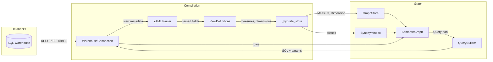
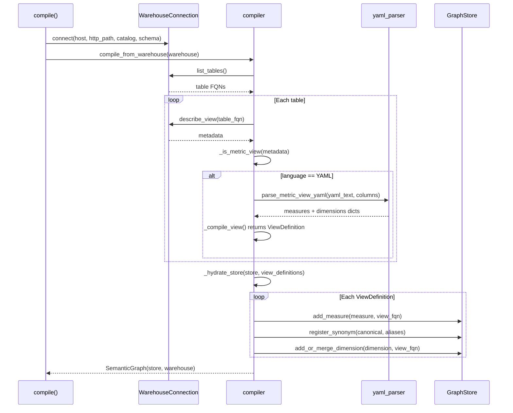
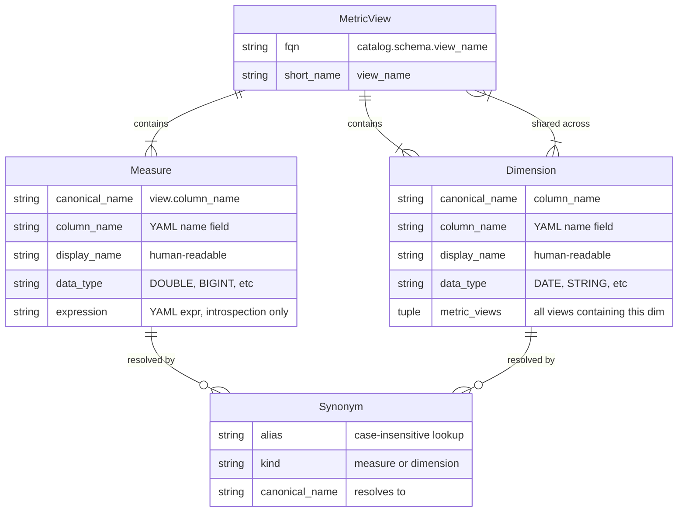
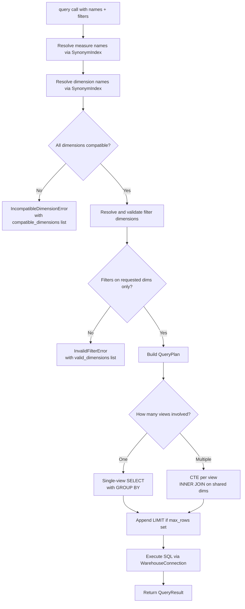
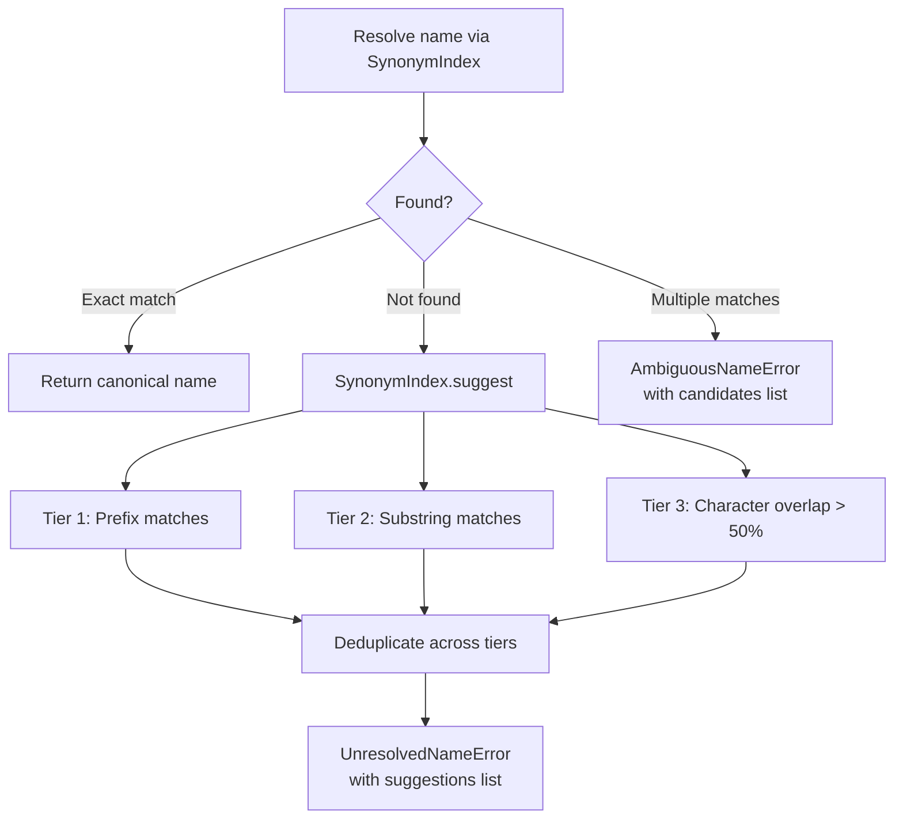

# Architecture

This document explains how the semantic layer is structured, how data flows through it, and why things work the way they do.

## System Overview

The library has two phases: **compilation** (warehouse introspection, building the graph) and **runtime** (querying, traversal, name resolution). The `WarehouseConnection` is the sole I/O boundary, used in both phases.



## Compilation Pipeline

Compilation starts with `compile()` (or `compile_from_warehouse()` directly). It introspects every table in the schema, identifies metric views by checking for `language=YAML` in the metadata, parses each one, and builds the graph.



### Why ViewDefinition exists

The compiler used to write directly to the GraphStore during parsing. Now it produces `ViewDefinition` objects as an intermediate step, then `_hydrate_store()` converts them into `Measure`/`Dimension` model objects and populates the store.

This matters because:
- It separates "what did we parse" from "how do we store it." You can inspect the ViewDefinitions before they hit the store.
- It documents the extraction boundary. If a second backend (non-Databricks) needs to produce the same graph, it just needs to produce `ViewDefinition` objects. The hydration logic stays the same.
- It makes the compiler testable in isolation. You can assert on the ViewDefinition output without needing a GraphStore.

### YAML parsing and fallback

The YAML parser handles Databricks metric view definitions. Important field name mappings:

| YAML field | Model field | Notes |
|---|---|---|
| `name` | `column_name` | The actual column name in the view |
| `display_name` | `display_name` | Human-readable label |
| `comment` | `description` | NOT `description` in the YAML |
| `expr` | `expression` | NOT `expression` in the YAML. Introspection only, never in SQL |
| `synonyms` | `synonyms` | Can be a string or list |

If YAML parsing fails (malformed YAML, missing definition), the parser falls back to column-type heuristics: numeric columns (INT, DOUBLE, DECIMAL, etc.) become measures, everything else becomes a dimension. This fallback means compilation never fails on a metric view; it just produces a less rich graph.

## Graph Model

The graph has four core entities: metric views, measures, dimensions, and synonyms.



### How canonical names work

Measures are scoped to their view: `{view_short_name}.{column_name}` lowercased. So `revenue` in the `sales` view becomes `sales.revenue`. This prevents collisions when multiple views have a column named `revenue`.

Dimensions are global: just `{column_name}` lowercased. This is intentional. When two views both have a `date` dimension, they're the same dimension. The library merges them, tracking which views contain each dimension in `metric_views`. This merge is what makes cross-view joins work.

### Dimension merging

When the compiler encounters a dimension that already exists (same canonical name from a different view), `InMemoryGraphStore.add_or_merge_dimension()` merges them:
- Keeps the first view's `column_name`, `display_name`
- Takes `description` and `data_type` from whichever has a value
- Unions `synonyms` and `metric_views`

This means the first view compiled "wins" for display metadata, but all views are tracked for compatibility.

### Synonym resolution

The `SynonymIndex` maps aliases to canonical names. For a measure `sales.revenue` with display name `"Revenue"` and synonyms `("rev", "total revenue")`, all of these resolve to `sales.revenue`:
- `"sales.revenue"` (canonical name)
- `"Revenue"` (display name)
- `"revenue"` (column name)
- `"rev"` (synonym)
- `"total revenue"` (synonym)
- `"REVENUE"` (case-insensitive)
- `"  Revenue  "` (whitespace-stripped)

Lookups are tagged by kind (`"measure"` or `"dimension"`) so that a column named `date` can exist as both a measure and a dimension without colliding.

## Query Execution



### Dimension compatibility

This is the central constraint. When you query measures from multiple views, only dimensions that exist in *every* involved view can be used. The library computes this as a set intersection.

Example: `sales` has dimensions `(date, region, product)`. `costs` has `(date, region, channel)`. Querying both means only `date` and `region` are valid. Requesting `product` raises `IncompatibleDimensionError`.

### Single-view vs multi-view SQL

**Single view** (all measures from one view):
```sql
SELECT
    `date`,
    `region`,
    `revenue`,
    `order_count`
FROM catalog.schema.sales
WHERE `region` = %s
GROUP BY 1, 2
```

**Multi-view** (measures from different views):
```sql
WITH cte_sales AS (
    SELECT `date`, `region`, `revenue`
    FROM catalog.schema.sales
    WHERE `region` = %s
    GROUP BY 1, 2
),
cte_costs AS (
    SELECT `date`, `region`, `total_cost`
    FROM catalog.schema.costs
    WHERE `region` = %s
    GROUP BY 1, 2
)
SELECT
    cte_sales.`date`,
    cte_sales.`region`,
    cte_sales.`revenue`,
    cte_costs.`total_cost`
FROM cte_sales
INNER JOIN cte_costs
    ON cte_sales.`date` = cte_costs.`date` AND cte_sales.`region` = cte_costs.`region`
```

Filters are duplicated into each CTE so Databricks can push them down. The INNER JOIN is on all shared dimensions.

### Why expressions aren't in the SQL

`Measure.expression` stores the YAML `expr` field (e.g., `SUM(amount)`). It is never emitted in generated SQL. Metric views are pre-aggregated views in Databricks; the aggregation logic is baked into the view definition itself. Emitting the expression would cause double-aggregation. The field exists purely for introspection.

## Filter System

Filters use `FilterClause` objects with a dimension name and a list of values:

- **Single value** (`values=["US"]`): generates `WHERE region = %s` with one bind param
- **Multiple values** (`values=["US", "EU"]`): generates `WHERE region IN (%s, %s)` with N bind params

All values use bind parameters, never string interpolation.

### get_filter_values

`get_filter_values(dimension_name, limit)` fetches distinct values for a dimension directly from the warehouse. It generates:

```sql
SELECT `region` AS value, COUNT(*) AS count
FROM catalog.schema.sales
GROUP BY `region`
ORDER BY count DESC
LIMIT 10
```

For dimensions shared across multiple views, it picks the first view in `metric_views`. Different views may return different values for the same dimension name; if that becomes a problem, the caller should specify which view's values they want (not currently supported, but the dimension's `metric_views` field exposes which views are available).

## Error Handling



Every error type carries structured context for programmatic recovery:

| Error | Extra fields | Purpose |
|---|---|---|
| `UnresolvedNameError` | `suggestions: list[str]` | Fuzzy matches from the synonym index |
| `AmbiguousNameError` | `candidates: list[str]` | All canonical names the alias maps to |
| `IncompatibleDimensionError` | `compatible_dimensions: list[str]` | Dimensions that *would* work |
| `InvalidFilterError` | `valid_dimensions: list[str]` | Dimensions the filter could target |

All extra fields default to empty lists, so existing `except` blocks that construct these errors without the new fields still work.

### Fuzzy matching

The `SynonymIndex.suggest()` method uses a three-tier approach with no external dependencies:

1. **Prefix match**: `"rev"` matches alias `"revenue"` (highest priority)
2. **Substring match**: `"revenue"` matches alias `"total revenue"` (medium)
3. **Character overlap**: `len(set(a) & set(b)) / len(set(a) | set(b)) > 0.5` (lowest, catches typos like `"revnue"`)

Results are deduplicated by canonical name (multiple aliases may point to the same canonical) and limited to 5 by default.

## GraphStore and Extensibility

`GraphStore` is an abstract base class. The library ships with `InMemoryGraphStore` (dict-based), but the ABC exists so you can swap in a different backend without changing compilation or query logic.

The ABC has three groups of methods:

**Write methods** (called by the compiler during hydration):
- `add_measure()`, `add_or_merge_dimension()`, `register_synonym()`

**Core read methods** (called by SemanticGraph for queries):
- `all_measures()`, `all_dimensions()`, `get_measure()`, `get_dimension()`
- `get_view_for_measure()`, `get_compatible_dimensions()`, `resolve_name()`

**Extended read methods** (called by traversal APIs and error handling):
- `suggest_name()`, `get_views()`, `get_measures_for_view()`, `get_dimensions_for_view()`

To implement a custom backend, subclass `GraphStore` and implement all abstract methods. Pass your store to `compile_from_warehouse(warehouse, store=MyStore())`.
